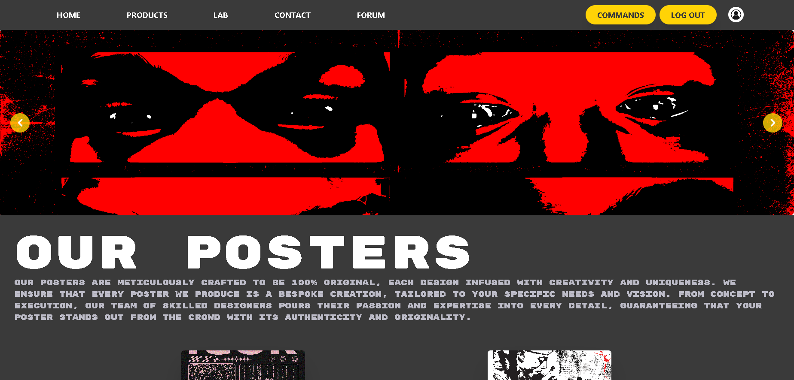
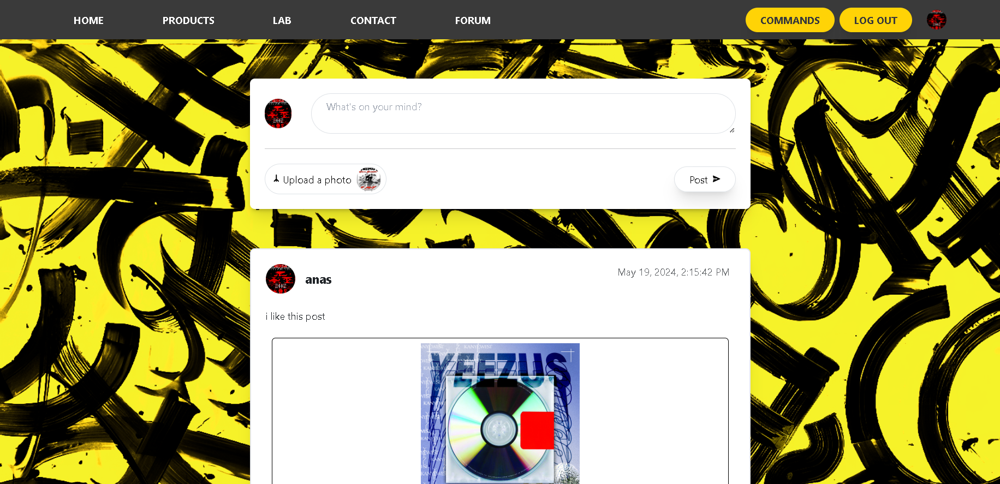
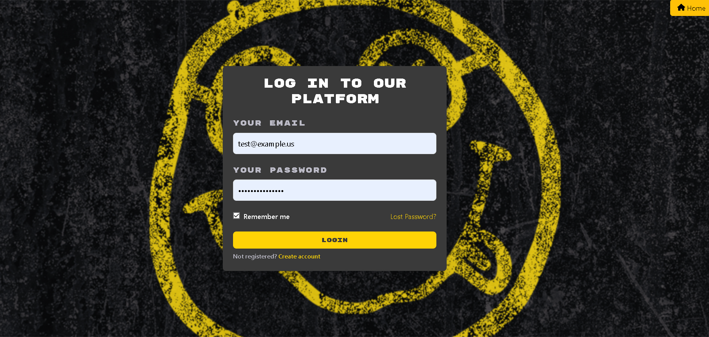
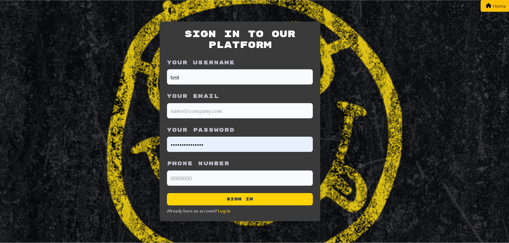

# Nerdevana - E-Commerce Website

An e-commerce platform for purchasing customized posters, developed collaboratively to explore and implement classic development methodologies. The project features a Symfony-powered backend, an Angular-based frontend, and a MySQL database. This project served as a hands-on learning experience in using modern frameworks to build scalable web applications.

## Table of Contents

- [Features](#features)
- [Technologies Used](#technologies-used)
- [Methodologies and Frameworks](#methodologies-and-frameworks)
- [Prerequisites](#prerequisites)
- [Installation](#installation)
- [Running the Project](#running-the-project)
- [Database Migrations](#database-migrations)
- [Screenshots](#screenshots)
- [Contributing](#contributing)
- [License](#license)

## Features

- User authentication and authorization
- Product catalog with search and filter functionality
- Shopping cart and checkout process
- Order management for users and administrators
- Responsive design for mobile and desktop

## Technologies Used

- **Backend:** Symfony
- **Frontend:** Angular
- **Database:** MySQL
- **Other Tools:** Composer, Node.js, npm

## Methodologies and Frameworks

### Classic Methodologies

The development of the Nerdevana e-commerce platform was guided by classic software development methodologies, including:

- **Waterfall Model:** Sequential stages were followed, starting from requirements gathering, design, implementation, testing, and maintenance. This approach ensured clear goals and structured deliverables at each phase of development.
- **Team Collaboration:** Regular meetings and well-documented project plans allowed for seamless coordination among team members, with distinct roles and responsibilities to maximize efficiency.

These methodologies provided a solid foundation for project execution, emphasizing planning, documentation, and phased development cycles.

### Symfony Framework

Symfony, a PHP framework, was chosen for the backend due to its robust set of tools and flexibility for building web applications. Key features of Symfony that were utilized in this project include:

- **MVC Architecture:** Enabled a clear separation of concerns, improving code maintainability and scalability.
- **Doctrine ORM:** Simplified database interactions and migrations, ensuring efficient handling of MySQL data.
- **Bundles:** Modular components allowed for streamlined development, encouraging code reuse and reducing redundancy.
- **Routing and Controllers:** Simplified the management of HTTP requests, providing a clean and efficient structure for API endpoints.

Symfony’s emphasis on best practices and modern PHP standards ensured the backend was both performant and secure.

## Prerequisites

- PHP >= 7.4
- Composer
- Node.js and npm
- MySQL

## Installation

### Backend

1. Clone the repository:
    ```sh
    git clone https://github.com/yourusername/Nerdevana--E-Commerce-Website.git
    cd Nerdevana--E-Commerce-Website/Backend
    ```

2. Install PHP dependencies:
    ```sh
    composer install
    ```

3. Create and configure the `.env` file:
    ```sh
    cp .env.example .env
    ```
    Update the `.env` file with your database credentials and other necessary configurations.

4. Create the database:
    ```sh
    php bin/console doctrine:database:create
    ```

5. Run database migrations:
    ```sh
    php bin/console doctrine:migrations:migrate
    ```

6. Load fixtures (optional):
    ```sh
    php bin/console doctrine:fixtures:load
    ```

### Frontend

1. Navigate to the frontend directory:
    ```sh
    cd ../Frontend
    ```

2. Install Node.js dependencies:
    ```sh
    npm install
    ```

## Running the Project

### Backend

Start the Symfony server:
```sh
php -S localhost:8000 -t public
```

### Frontend

Start the Angular development server:
```sh
ng serve --open
```

The application will be accessible at `http://localhost:4200` for the frontend and `http://localhost:8000` for the backend.

## Database Migrations

To update the database schema after making changes to the entity files:

1. Generate a new migration file:
    ```sh
    php bin/console make:migration
    ```

2. Execute the migration:
    ```sh
    php bin/console doctrine:migrations:migrate
    ```


## Screenshots

Here are some screenshots showcasing the application:

### Home Page


### Forum Page


### Login Form


### SignUp Form



## Contributing

Contributions are welcome! Please follow these steps:

1. Fork the repository.
2. Create a new branch for your feature or bug fix:
    ```sh
    git checkout -b feature-name
    ```
3. Commit your changes:
    ```sh
    git commit -m "Description of changes"
    ```
4. Push to your branch:
    ```sh
    git push origin feature-name
    ```
5. Open a pull request and describe your changes.

## License

This project is licensed under the [MIT License](LICENSE).

